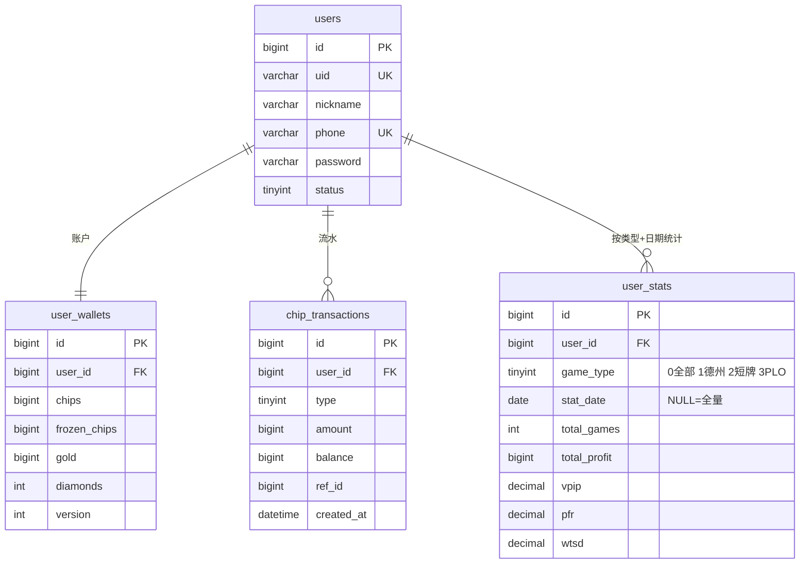
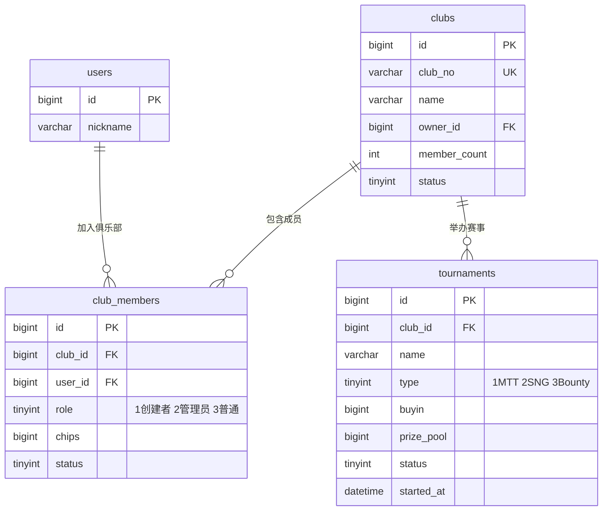
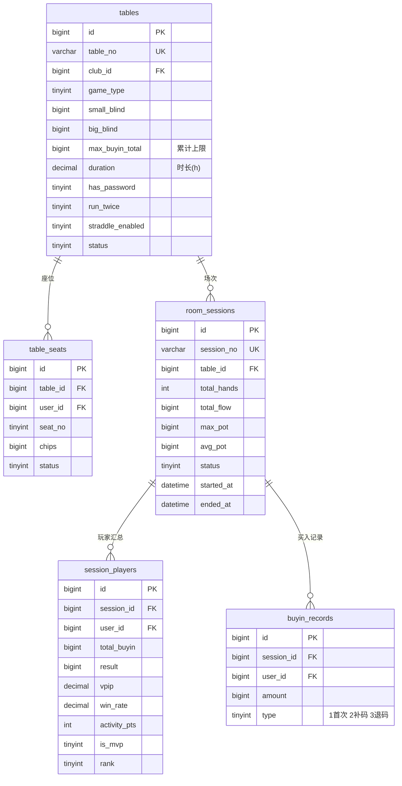
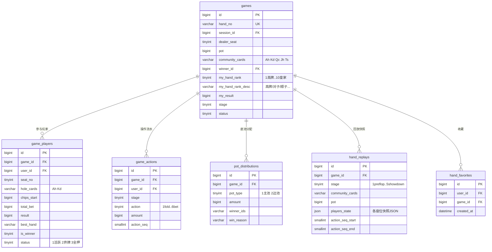
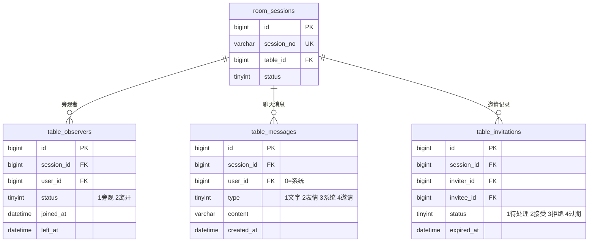

# 德州扑克系统技术方案

> 版本：v5 | 最后更新：2026-06-10

---

## 一、系统概述

对标 WePoker，构建支持**好友桌（密码局）+ 俱乐部私桌 + 锦标赛**的在线德州扑克平台。

核心功能模块：
- **好友桌**：创建/加入密码局，支持德州/短牌/PLO/SNG/十三水
- **俱乐部**：私有圈子，独立筹码体系，管理员控桌
- **生涯统计**：多维度数据（牌局/牌谱/个人/对手/位置/运势/牌组）
- **牌谱回放**：逐手/逐阶段回放，支持收藏
- **实时对战**：WebSocket 推送，行动倒计时，实时排名面板
- **社交**：桌内聊天、邀请好友、旁观

---

## 二、技术栈

| 层次 | 技术选型 | 版本 | 说明 |
|------|---------|------|------|
| 后端框架 | GoFrame | v2.10.2 | HTTP / WebSocket / ORM / 配置 / 日志一体化 |
| 语言 | Go | 1.26.4 | 高并发，goroutine 天然适合牌桌模型 |
| 数据库 | MySQL | 8.0.46 | 持久化存储，JSON 字段存回放快照 |
| 缓存 | Redis | 7.4.9 | 牌局实时状态、座位锁、限流、Token |
| 实时通信 | WebSocket | GoFrame 内置 | 牌局状态推送、聊天消息 |
| 消息队列 | Redis Stream | — | 游戏动作异步落库，削峰 |
| 游戏引擎 | 纯 Go 模块 | — | 发牌/比牌/底池/回放，无第三方依赖 |
| 认证 | JWT | v5.3.1 | 7天有效期，Redis 存 Token 支持踢下线 |
| 部署 | Docker + K8s | — | 容器化，游戏服务水平扩展 |

---

## 三、系统架构

```
┌──────────────────────────────────────────────────────────┐
│                        客户端                             │
│            App (iOS/Android) / Web / 小程序               │
└─────────────────────┬────────────────────────────────────┘
                      │  HTTP / WebSocket
┌─────────────────────▼────────────────────────────────────┐
│                      API 网关                             │
│               JWT鉴权 / 限流 / 路由分发                    │
└──────┬──────────────┬──────────────┬──────────────┬──────┘
       │              │              │              │
┌──────▼─────┐ ┌──────▼─────┐ ┌─────▼──────┐ ┌────▼──────┐
│  用户服务  │ │  俱乐部服务 │ │  大厅服务  │ │ 统计服务  │
│ 注册/登录  │ │ 创建/管理  │ │ 桌列表/搜索│ │ 生涯/牌谱 │
└────────────┘ └────────────┘ └────────────┘ └───────────┘
                              │
┌─────────────────────────────▼────────────────────────────┐
│                      游戏服务（核心）                       │
│                                                           │
│  ┌──────────────┐  ┌──────────────┐  ┌──────────────┐   │
│  │  桌管理器    │  │  局状态机    │  │  游戏引擎    │   │
│  │TableManager  │  │  GameFSM     │  │PokerEngine   │   │
│  │每桌一goroutine│  │preflop→show  │  │发牌/比牌/边池│   │
│  └──────────────┘  └──────────────┘  └──────────────┘   │
│                                                           │
│  ┌──────────────┐  ┌──────────────┐  ┌──────────────┐   │
│  │  WS Hub      │  │  行动定时器  │  │  回放引擎    │   │
│  │  消息广播    │  │  超时自动弃牌│  │  阶段快照    │   │
│  └──────────────┘  └──────────────┘  └──────────────┘   │
└─────────────────────────────┬────────────────────────────┘
                              │
               ┌──────────────┴─────────────┐
               │                             │
        ┌──────▼──────┐             ┌────────▼──────┐
        │   MySQL 8.0  │             │   Redis 7.4   │
        │  持久化存储  │             │  实时状态缓存  │
        └─────────────┘             └───────────────┘
```

---

## 四、项目目录结构

```
claude-test/
├── main.go                        # 入口，注册 MySQL/Redis 驱动
├── api/
│   └── user/v1/user.go            # 用户接口定义（注册/登录/个人信息）
│   └── table/v1/                  # 牌桌接口定义
│   └── game/v1/                   # 游戏接口定义
│   └── club/v1/                   # 俱乐部接口定义
│   └── stats/v1/                  # 统计/牌谱接口定义
├── internal/
│   ├── cmd/cmd.go                 # 路由注册
│   ├── controller/
│   │   ├── user/                  # 用户控制器 ✅
│   │   ├── table/                 # 牌桌控制器
│   │   ├── game/                  # 游戏控制器
│   │   ├── club/                  # 俱乐部控制器
│   │   └── stats/                 # 统计控制器
│   ├── logic/
│   │   ├── user/user.go           # 用户业务逻辑 ✅
│   │   ├── table/                 # 建桌/入座/买入
│   │   ├── game/                  # 游戏流程编排
│   │   ├── club/                  # 俱乐部管理
│   │   └── stats/                 # 生涯/牌谱统计
│   ├── model/entity/
│   │   └── user.go                # 用户/钱包实体 ✅
│   ├── dao/                       # 数据访问层（自动生成）
│   └── game/                      # 游戏核心引擎
│       ├── engine.go              # 总入口
│       ├── deck.go                # 牌组 + Fisher-Yates 洗牌
│       ├── hand_eval.go           # 手牌评估（7张选5张最优）
│       ├── pot.go                 # 底池/边池计算
│       ├── fsm.go                 # 局状态机
│       └── replay.go              # 回放快照生成
├── utility/
│   ├── jwt/jwt.go                 # JWT 生成/解析 ✅
│   └── ws/hub.go                  # WebSocket 连接管理
└── manifest/
    ├── config/config.yaml         # MySQL + Redis 配置 ✅
    └── sql/poker_schema.sql       # 全量 DDL（21张表）✅
```

---

## 五、数据库设计（v5）

### 5.0 需求 → 表结构映射

| 需求 | 关键表 | 核心字段 |
|------|--------|---------|
| **①组局** | `tables` | game_type / blind / buyin / duration / 高级设置19项 |
| **②邀请好友** | `table_invitations` | table_id（组局阶段）/ session_id（开局后）/ expired_at |
| **③开局** | `room_sessions` | started_at / status=1 |
| **④对局** | `games` + `game_players` + `game_actions` | shuffle_seed / hole_cards / action / stage |
| **⑤加购筹码** | `buyin_records` | type=2补码 / status=审核 / approved_by |
| **⑥每局计时** | `games` + `game_actions` | duration_ms（手牌用时）/ action_ms（行动用时）|
| **⑦对局结束** | `room_sessions` | ended_at / end_reason / status=2 |
| **⑧计算筹码** | `session_players` + `buyin_records` | chips_final / total_buyin → result=chips_final-total_buyin |
| **⑨记录牌谱** | `games` + `game_players` + `hand_replays` | hand_no / hole_cards / hand_rank / hand_replays.players_state |
| **⑩每局战绩** | `game_players` | result / hand_rank / is_vpip / is_pfr / went_to_sd |
| **⑪日/周/月/自定义统计** | `user_stats` + `session_players` + `room_sessions` | stat_type / stat_date / stat_end / idx_started_at |

### 5.1 完整表清单（22 张）

| # | 表名 | 分类 | 说明 | v5变更 |
|---|------|------|------|--------|
| 1 | `users` | 用户 | 基本信息，手机号注册 | — |
| 2 | `user_wallets` | 用户 | 筹码/金币/钻石，乐观锁防并发 | — |
| 3 | `chip_transactions` | 用户 | 每笔筹码变动流水 | — |
| 4 | `user_stats` | 用户 | 多维统计（类型+粒度+日期） | — |
| 5 | `clubs` | 俱乐部 | 俱乐部基本信息 | — |
| 6 | `club_members` | 俱乐部 | 成员角色（创建者/管理员/普通） | — |
| 7 | `tables` | 牌桌 | 牌桌全量配置（含高级设置19项） | max_seats 上限改为10；run_twice 语义明确为"功能开关" |
| 8 | `table_seats` | 牌桌 | 玩家座位及桌上筹码实时状态 | — |
| 9 | `room_sessions` | 场次 | 一场完整对局汇总 | — |
| 10 | `session_players` | 场次 | 场次内每位玩家结算 | — |
| 11 | `buyin_records` | 场次 | 每次买入/补码/退码明细 | — |
| 12 | `table_observers` | 社交 | 旁观者进出记录 | — |
| 13 | `table_messages` | 社交 | 桌内聊天（文字/表情/系统/邀请） | — |
| 14 | `table_invitations` | 社交 | 邀请好友，组局/对局两阶段 | — |
| 15 | `games` | 手牌 | 每一手牌完整记录 | 删除 winner_id；新增 is_split_pot / run_twice_used / run_twice_board2；stage 补充 0=盲注阶段 |
| 16 | `game_players` | 手牌 | 每手牌参与玩家 | 新增 position（SB/BB/BTN等）/ forced_bet / is_show_card；hand_rank 注释明确强度值语义 |
| 17 | `game_actions` | 手牌 | 每个操作流水 | action 新增 7=blind_post / 8=ante_post / 9=straddle；stage 补充 0=盲注阶段 |
| 18 | `pot_distributions` | 手牌 | 底池分配汇总行 | 新增 winner_count / win_rank；winner_ids 改为展示用 |
| 19 | `pot_winner_details` | 手牌 | **新增**：底池分配明细，每赢家一行 | Split Pot 每位赢家的实际获得金额 |
| 20 | `hand_favorites` | 牌谱 | 用户收藏的手牌（星标） | — |
| 21 | `hand_replays` | 牌谱 | 各阶段回放快照（JSON） | — |
| 22 | `tournaments` | 赛事 | 锦标赛（MTT/SNG/赏金赛） | — |

### 5.2 核心表关系

```
users (1)─────────────(1) user_wallets
users (1)─────────────(N) chip_transactions
users (1)─────────────(1) user_stats [game_type + stat_date 分维度]
users (N)─────────────(N) clubs          ← club_members
clubs (1)─────────────(N) tables
tables (1)────────────(N) table_seats    ← users
tables (1)────────────(N) room_sessions
  room_sessions (1)───(N) session_players ← users  [含vpip/win_rate/activity_pts/mvp]
  room_sessions (1)───(N) buyin_records
  room_sessions (1)───(N) table_observers
  room_sessions (1)───(N) table_messages
  room_sessions (1)───(N) table_invitations
  room_sessions (1)───(N) games
    games (1)──────── (N) game_players
    games (1)──────── (N) game_actions
    games (1)──────── (N) pot_distributions
    games (1)──────── (N) hand_replays    [preflop/flop/turn/river/showdown 快照]
    games (N)──────── (N) users           ← hand_favorites [收藏]
clubs (1)─────────────(N) tournaments
```

### 5.3 数据库建模设计图

#### 全局 ER 总览（模块分区）

```mermaid
erDiagram

    %% ───────── 用户模块 ─────────
    users {
        bigint      id          PK
        varchar20   uid         UK "用户编号"
        varchar50   nickname
        varchar20   phone       UK
        varchar255  password
        tinyint     status         "1正常 2禁用"
        datetime    last_login_at
    }
    user_wallets {
        bigint      id          PK
        bigint      user_id     FK
        bigint      chips          "筹码余额"
        bigint      frozen_chips   "桌上冻结"
        bigint      gold
        int         diamonds
        int         version        "乐观锁"
    }
    chip_transactions {
        bigint      id          PK
        bigint      user_id     FK
        tinyint     type           "1充值 2提现 3赢 4输 5买入 6带离"
        bigint      amount
        bigint      balance
        bigint      ref_id         "关联game_id等"
    }
    user_stats {
        bigint      id          PK
        bigint      user_id     FK
        tinyint     game_type      "0全部 1德州..."
        date        stat_date      "NULL=全量"
        int         total_games
        int         total_sessions
        bigint      total_profit
        bigint      total_buyin
        bigint      total_flow
        bigint      biggest_pot
        decimal     vpip
        decimal     pfr
        decimal     wtsd
    }

    %% ───────── 俱乐部模块 ─────────
    clubs {
        bigint      id          PK
        varchar20   club_no     UK
        varchar100  name
        bigint      owner_id    FK
        int         member_count
        tinyint     status
    }
    club_members {
        bigint      id          PK
        bigint      club_id     FK
        bigint      user_id     FK
        tinyint     role           "1创建者 2管理员 3普通"
        bigint      chips
        tinyint     status
    }
    tournaments {
        bigint      id          PK
        bigint      club_id     FK
        varchar100  name
        tinyint     type           "1MTT 2SNG 3Bounty"
        bigint      buyin
        bigint      prize_pool
        int         current_players
        tinyint     status
    }

    %% ───────── 牌桌模块 ─────────
    tables {
        bigint      id          PK
        varchar20   table_no    UK
        bigint      club_id     FK
        bigint      creator_id  FK
        tinyint     game_type      "1德州 2短牌 3PLO 4SNG 5十三水"
        bigint      small_blind
        bigint      big_blind
        bigint      ante
        tinyint     straddle_enabled
        bigint      min_buyin
        bigint      max_buyin
        bigint      max_buyin_total "累计上限"
        decimal     duration       "时长(h)"
        tinyint     has_password
        varchar20   password
        tinyint     run_twice
        tinyint     low_water_insurance
        tinyint     crit_gameplay
        tinyint     activity_points
        tinyint     auto_rebuy
        tinyint     buyin_approval
        tinyint     delay_show_card
        tinyint     random_seat
        tinyint     spectator_mute
        tinyint     gps_ip_restrict
        tinyint     full_table_start
        tinyint     max_seats
        varchar50   tag
        tinyint     status         "1等待 2进行 3关闭"
    }
    table_seats {
        bigint      id          PK
        bigint      table_id    FK
        bigint      user_id     FK
        tinyint     seat_no
        bigint      chips
        tinyint     status         "1在座 2离座"
        tinyint     is_sitting_out
    }

    %% ───────── 场次模块 ─────────
    room_sessions {
        bigint      id          PK
        varchar30   session_no  UK
        bigint      table_id    FK
        bigint      creator_id  FK
        tinyint     game_type
        bigint      small_blind
        bigint      big_blind
        int         total_hands
        bigint      total_flow
        bigint      total_buyin
        bigint      max_pot
        bigint      avg_pot
        int         player_count
        int         spectator_count
        decimal     duration
        tinyint     status
        datetime    started_at
        datetime    ended_at
    }
    session_players {
        bigint      id          PK
        bigint      session_id  FK
        bigint      user_id     FK
        tinyint     seat_no
        int         total_hands
        bigint      total_buyin
        bigint      result         "盈亏"
        decimal     vpip           "入池率%"
        decimal     win_rate       "胜率%"
        int         activity_pts   "活跃度积分"
        tinyint     is_mvp
        tinyint     rank
    }
    buyin_records {
        bigint      id          PK
        bigint      session_id  FK
        bigint      user_id     FK
        bigint      amount
        tinyint     type           "1首次 2补码 3退码"
    }

    %% ───────── 社交模块 ─────────
    table_observers {
        bigint      id          PK
        bigint      session_id  FK
        bigint      user_id     FK
        tinyint     status         "1旁观 2离开"
        datetime    joined_at
        datetime    left_at
    }
    table_messages {
        bigint      id          PK
        bigint      session_id  FK
        bigint      user_id     FK "0=系统"
        tinyint     type           "1文字 2表情 3系统 4邀请"
        varchar500  content
        datetime    created_at
    }
    table_invitations {
        bigint      id          PK
        bigint      session_id  FK
        bigint      inviter_id  FK
        bigint      invitee_id  FK
        tinyint     status         "1待处理 2接受 3拒绝 4过期"
        datetime    expired_at
    }

    %% ───────── 手牌模块 ─────────
    games {
        bigint      id          PK
        varchar30   hand_no     UK "手牌唯一ID"
        bigint      session_id  FK
        bigint      table_id    FK
        tinyint     dealer_seat
        bigint      small_blind
        bigint      big_blind
        bigint      pot
        varchar20   community_cards "Ah Kd Qc Jh Ts"
        bigint      winner_id   FK
        tinyint     my_hand_rank   "1高牌..10皇家"
        varchar20   my_hand_rank_desc
        bigint      my_result
        tinyint     stage          "1-5"
        tinyint     status         "1进行 2结束"
        datetime    started_at
        datetime    ended_at
    }
    game_players {
        bigint      id          PK
        bigint      game_id     FK
        bigint      user_id     FK
        tinyint     seat_no
        varchar10   hole_cards     "Ah Kd"
        bigint      chips_start
        bigint      chips_end
        bigint      total_bet
        bigint      result
        varchar30   best_hand
        tinyint     is_winner
        tinyint     fold_stage
        tinyint     status         "1活跃 2弃牌 3全押"
    }
    game_actions {
        bigint      id          PK
        bigint      game_id     FK
        bigint      user_id     FK
        tinyint     seat_no
        tinyint     stage
        tinyint     action         "1fold 2check 3call 4raise 5allin 6bet"
        bigint      amount
        bigint      pot_after
        smallint    action_seq
        datetime    created_at
    }
    pot_distributions {
        bigint      id          PK
        bigint      game_id     FK
        tinyint     pot_type       "1主池 2边池"
        tinyint     pot_index
        bigint      amount
        varchar200  winner_ids     "逗号分隔"
        varchar50   win_reason
    }

    %% ───────── 牌谱模块 ─────────
    hand_favorites {
        bigint      id          PK
        bigint      user_id     FK
        bigint      game_id     FK
        datetime    created_at
    }
    hand_replays {
        bigint      id          PK
        bigint      game_id     FK
        tinyint     stage          "1-5"
        varchar20   community_cards
        bigint      pot
        json        players_state  "各座位快照"
        smallint    action_seq_start
        smallint    action_seq_end
    }

    %% ───────── 关系定义 ─────────
    users           ||--||  user_wallets        : "1:1 账户"
    users           ||--o{  chip_transactions   : "1:N 流水"
    users           ||--o{  user_stats          : "1:N 多维统计"
    users           ||--o{  club_members        : "加入"
    clubs           ||--o{  club_members        : "包含"
    clubs           ||--o{  tables              : "1:N 开桌"
    clubs           ||--o{  tournaments         : "1:N 赛事"
    tables          ||--o{  table_seats         : "1:N 座位"
    tables          ||--o{  room_sessions       : "1:N 场次"
    users           ||--o{  table_seats         : "入座"
    room_sessions   ||--o{  session_players     : "1:N 玩家汇总"
    room_sessions   ||--o{  buyin_records       : "1:N 买入记录"
    room_sessions   ||--o{  table_observers     : "1:N 旁观"
    room_sessions   ||--o{  table_messages      : "1:N 聊天"
    room_sessions   ||--o{  table_invitations   : "1:N 邀请"
    room_sessions   ||--o{  games               : "1:N 手牌"
    users           ||--o{  session_players     : "场次结算"
    games           ||--o{  game_players        : "1:N 玩家"
    games           ||--o{  game_actions        : "1:N 动作"
    games           ||--o{  pot_distributions   : "1:N 底池"
    games           ||--o{  hand_replays        : "1:N 快照"
    games           ||--o{  hand_favorites      : "1:N 收藏"
    users           ||--o{  hand_favorites      : "收藏"
```



#### 分模块局部 ER 图

##### 模块一：用户与账户



##### 模块二：俱乐部与赛事



##### 模块三：牌桌与场次



##### 模块四：手牌与回放



##### 模块五：社交互动



### 5.3 关键业务流程与表交互

#### 流程一：组局 → 邀请好友 → 开局

```
创建牌桌
  INSERT tables (game_type, blind, buyin, duration, 高级设置...)
        ↓
邀请好友（session 未创建，table_id 有值，session_id=0）
  INSERT table_invitations (table_id=X, session_id=0, invitee_id, expired_at)
  → 推送 WebSocket 通知被邀请人
        ↓
玩家入座
  INSERT/UPDATE table_seats (table_id, user_id, seat_no, chips)
  UPDATE user_wallets SET frozen_chips += buyin  ← 乐观锁
  INSERT buyin_records (type=1首次买入, status=2已批准)
        ↓
满足开局条件（人满 or 手动开局）
  INSERT room_sessions (table_id, started_at, status=1)
  UPDATE table_invitations SET session_id=X  ← 回填 session_id
  → 游戏引擎启动第一手
```

#### 流程二：对局（单手牌生命周期）

```
发起新手牌
  INSERT games (session_id, hand_no, shuffle_seed, dealer_seat, started_at)
  ← shuffle_seed = crypto/rand 生成，用于公平性验证
        ↓
发手牌（仅推给本人）
  INSERT game_players (game_id, user_id, hole_cards, chips_start)
  → WS推送 {"type":"deal","hole_cards":"10d 9d"}  ← 只发给本人
        ↓
每个行动阶段循环（preflop→flop→turn→river）
  INSERT game_actions (game_id, action, amount, action_seq, action_ms)
  UPDATE Redis GameState (pot, current_seat, deadline)
  → WS广播最新牌局状态
        ↓
摊牌/结算
  ← 计算最优5张牌（7选5），写 game_players.hand_rank/result
  INSERT pot_distributions (game_id, pot_type, amount, winner_ids)
  UPDATE session_players.result / total_hands / vpip / win_rate
  UPDATE room_sessions.total_hands / total_flow / avg_pot
  INSERT hand_replays × 5（每阶段快照）
  UPDATE games SET ended_at, duration_ms, status=2
```

#### 流程三：加购筹码（补码）

```
玩家发起补码请求
  INSERT buyin_records (session_id, user_id, amount, type=2, status=1待审核)
        ↓
  if tables.buyin_approval = 0（免审核）:
    UPDATE buyin_records SET status=2已批准
    UPDATE table_seats SET chips += amount
    UPDATE user_wallets SET chips -= amount, frozen_chips += amount  ← 乐观锁
    UPDATE session_players.total_buyin += amount
  else（需审核）:
    → WS推送给管理员 {"type":"buyin_request", ...}
    管理员批准: UPDATE buyin_records SET status=2, approved_by, approved_at
               → 执行上方筹码变更
    管理员拒绝: UPDATE buyin_records SET status=3
        ↓
  检查累计买入限制
    SELECT SUM(amount) FROM buyin_records WHERE session_id=X AND user_id=Y AND status=2
    if 累计 + 本次 > tables.max_buyin_total: 拒绝（0=不限）
```

#### 流程四：对局结束 → 计算筹码

```
触发结束（时间到 / 手动 / 全部离座）
  UPDATE room_sessions SET status=2, ended_at=NOW(), end_reason=1/2/3
        ↓
逐玩家结算
  chips_final = table_seats.chips（桌上剩余）
  total_buyin = SUM(buyin_records.amount WHERE status=2)
  result      = chips_final - total_buyin（正数=赢，负数=输）
  UPDATE session_players SET chips_final, result, rank, is_mvp
        ↓
释放筹码
  UPDATE user_wallets SET chips += chips_final, frozen_chips -= total_buyin
  INSERT chip_transactions (type=3赢/4输, amount=result)
        ↓
更新统计
  UPDATE user_stats (按 stat_date / game_type / stat_type 聚合)
```

#### 流程五：战绩统计查询

```sql
-- 按天查询（stat_type=1，取预聚合）
SELECT * FROM user_stats
WHERE user_id=? AND game_type=? AND stat_type=1 AND stat_date=?

-- 按周/月查询（聚合 session_players）
SELECT
  COUNT(DISTINCT rs.id)       AS sessions,
  SUM(sp.total_hands)         AS hands,
  SUM(sp.result)              AS profit,
  SUM(sp.total_buyin)         AS buyin,
  AVG(sp.vpip)                AS vpip,
  AVG(sp.win_rate)            AS win_rate
FROM session_players sp
JOIN room_sessions rs ON rs.id = sp.session_id
WHERE sp.user_id = ?
  AND rs.game_type = ?          -- 游戏类型筛选
  AND rs.started_at >= ?        -- 开始日期
  AND rs.started_at <  ?        -- 结束日期（日/周/月/自定义）

-- 索引：room_sessions(started_at) + session_players(user_id, joined_at)
```

### 5.4 游戏类型枚举

| 值 | 类型 | 英文 |
|----|------|------|
| 1 | 德州 | Texas Hold'em |
| 2 | 短牌 | Short Deck |
| 3 | PLO | Pot-Limit Omaha |
| 4 | SNG | Sit & Go |
| 5 | 十三水 | Chinese Poker |

### 5.4 牌桌配置字段（tables 表）

**基础配置**（创建牌局页上半部分）

| 字段 | 类型 | 对应UI |
|------|------|--------|
| `game_type` | tinyint | 游戏类型选择 |
| `has_password` | tinyint | 密码局开关 |
| `password` | varchar(20) | 入场密码 |
| `small_blind` | bigint | 小盲注（如 15） |
| `big_blind` | bigint | 大盲注（如 30） |
| `straddle_enabled` | tinyint | Straddle 开关（金额=大盲×2） |
| `ante` | bigint | 前注 Ante |
| `min_buyin` | bigint | 最小买入 |
| `max_buyin` | bigint | 单次最大买入 |
| `max_buyin_total` | bigint | 累计最大买入（0=不限） |
| `duration` | decimal(4,1) | 时长(h)：0.5/1/1.5/2/2.5/3/4/6/8 |
| `max_seats` | tinyint | 桌人数：2-9 |
| `tag` | varchar(50) | 自定义标签（如"非刀流的牌局"） |

**玩法开关**（创建牌局页下半部分）

| 字段 | 类型 | 对应UI |
|------|------|--------|
| `run_twice` | tinyint | All-In 后支持发两次 |
| `low_water_insurance` | tinyint | 低水保险 |
| `crit_gameplay` | tinyint | 暴击玩法 |
| `activity_points` | tinyint | 活跃度积分 |
| `auto_rebuy` | tinyint | 自动补码/退码 |
| `buyin_approval` | tinyint | 带入审核 |
| `delay_show_card` | tinyint | 延迟看牌 |
| `random_seat` | tinyint | 随机入座 |
| `spectator_mute` | tinyint | 旁观者禁言 |
| `gps_ip_restrict` | tinyint | GPS 和 IP 限制 |
| `full_table_start` | tinyint | 人满开局 |

---

## 六、核心模块设计

### 6.1 游戏状态机（FSM）

```
  ┌──────────────────────────────────────────────────────┐
  │  等待玩家（≥2人，最多10人）                            │
  └──────────────────────┬───────────────────────────────┘
                         ▼
  ┌──────────────────────────────────────────────────────┐
  │  stage=0  盲注阶段（Blinds）                          │
  │  SB强制投入小盲 → BB强制投入大盲 → Ante前注（可选）   │
  │  → Straddle（可选，UTG投入2×BB）                      │
  │  动作类型：7=blind_post / 8=ante_post / 9=straddle    │
  └──────────────────────┬───────────────────────────────┘
                         ▼
  ┌────────────────────────────────────────────────────────────────────────────┐
  │  stage=1 PRE_FLOP → stage=2 FLOP → stage=3 TURN → stage=4 RIVER          │
  │                                                                             │
  │  每阶段：等待行动 → fold/check/call/raise/allin/bet → 检查结束条件         │
  │  行动顺序：preflop从UTG开始；flop/turn/river从SB（庄家左侧第一活跃玩家）   │
  │                                                                             │
  │  提前结束：所有人弃牌 / 只剩一人未弃 → 直接结算，跳过 SHOWDOWN             │
  │  Allin场景：产生边池，run_twice_used=1时发两次公共牌                        │
  └────────────────────────────────────────────────────────────────────────────┘
                         ▼
  ┌──────────────────────────────────────────────────────┐
  │  stage=5  SHOWDOWN 摊牌                               │
  │  → 玩家选择亮牌(is_show_card=1)或盖牌(Muck=0)         │
  │  → 系统计算最优5张（7选5），写 hand_rank              │
  │  → Split Pot：INSERT pot_winner_details 每赢家一行    │
  └──────────────────────┬───────────────────────────────┘
                         ▼
  ┌──────────────────────────────────────────────────────┐
  │  结算                                                 │
  │  → 写 pot_winner_details（每赢家精确金额）            │
  │  → 写 pot_distributions（汇总，is_split_pot标记）     │
  │  → 更新 room_sessions / session_players               │
  │  → 生成 hand_replays 快照（5条，对应5个阶段）         │
  │  → 开始下一手                                         │
  └──────────────────────────────────────────────────────┘
```

### 6.2 Redis 游戏状态结构

每张牌桌实时状态存 Redis Hash，key = `table_state:{table_id}`：

```go
type GameState struct {
    SessionID      int64                 // 当前场次
    GameID         int64                 // 当前手牌ID
    Stage          int                   // 1preflop 2flop 3turn 4river 5showdown
    Pot            int64                 // 当前底池
    SidePots       []SidePot             // 边池列表
    CommunityCards []string              // 公共牌 ["Ah","Kd","Qc"]
    Players        map[int]*PlayerState  // seat_no → 状态
    CurrentSeat    int                   // 当前行动座位
    ActionDeadline int64                 // Unix 毫秒时间戳
    DealerSeat     int                   // 庄家位
    HandIndex      int                   // 本场第几手（回放进度分子）
    TotalHands     int                   // 本场总手数（回放进度分母）
}

type PlayerState struct {
    UserID    int64
    Nickname  string
    Avatar    string
    Chips     int64   // 桌上筹码
    Bet       int64   // 本轮已下注
    Status    int     // 1活跃 2弃牌 3全押
    HoleCards string  // 仅发给本人："Ah Kd"
}
```

### 6.3 游戏引擎

```go
// ⚠️ 手牌内部强度值（hand_eval.go）
// 注意：此值越大表示牌型越强，用于内部比牌逻辑
// 与 rules.md 展示排名方向相反（rules.md: 1=最强皇家同花顺, 10=最弱高牌）
// 存储字段：game_players.hand_rank
const (
    HighCard      = 1   // 高牌      rules.md排名: 10
    OnePair       = 2   // 一对      rules.md排名: 9
    TwoPair       = 3   // 两对      rules.md排名: 8
    ThreeOfAKind  = 4   // 三条      rules.md排名: 7
    Straight      = 5   // 顺子      rules.md排名: 6
    Flush         = 6   // 同花      rules.md排名: 5
    FullHouse     = 7   // 葫芦      rules.md排名: 4
    FourOfAKind   = 8   // 四条/金刚 rules.md排名: 3
    StraightFlush = 9   // 同花顺    rules.md排名: 2
    RoyalFlush    = 10  // 皇家同花顺 rules.md排名: 1
)

// 位置枚举（game_players.position）
// 依据 rules.md：庄家(BTN)左1=SB，左2=BB，左3=UTG
const (
    PosBTN  = 0  // 庄家 Button (D)
    PosSB   = 1  // 小盲 Small Blind
    PosBB   = 2  // 大盲 Big Blind
    PosUTG  = 3  // 枪口位 Under The Gun
    PosUTG1 = 4  // UTG+1
    PosMP   = 5  // 中间位 Middle Position
    PosHJ   = 6  // 劫持位 Hijack
    PosCO   = 7  // 关煞位 Cutoff
)

// 动作枚举（game_actions.action）
const (
    ActionFold      = 1  // 弃牌
    ActionCheck     = 2  // 过牌（当前无人下注时可用）
    ActionCall      = 3  // 跟注
    ActionRaise     = 4  // 加注（已有人下注后再加）
    ActionAllin     = 5  // 全押
    ActionBet       = 6  // 下注（本轮首次投入）
    ActionBlind     = 7  // 盲注投入（SB/BB强制，stage=0）
    ActionAnte      = 8  // 前注投入（所有人强制，stage=0）
    ActionStraddle  = 9  // 骑马注（UTG可选，=2×BB，stage=0）
)

// 核心函数
func Shuffle(deck []Card) []Card                        // Fisher-Yates + crypto/rand
func EvalBest5(hole []Card, board []Card) HandResult   // 7选5最优组合（2底牌+5公共牌）
func CalcPots(players []*PlayerState) []Pot            // 主池+边池切割（按全押金额分层）
func SplitPot(pot int64, winners []int64) []PotShare   // 平分底池（含奇数筹码处理）
```

### 6.4 边池计算与 Split Pot

```
─── 边池计算（All-In场景）───────────────────────────────────
场景：A 全押100，B 全押300，C 有500
──────────────────────────────────────────────────
主池  = 100 × 3 = 300     → A / B / C 均可赢
边池1 = (300-100) × 2 = 400 → B / C 可赢
退还  = 500 - 300 = 200   → 归还 C（多投筹码原路退回）

算法：
  1. 筛出全押玩家，按全押金额升序排列
  2. 逐层切割：每层金额 = 当层最小全押额 × 该层参与人数
  3. 弃牌玩家投入已进底池，但不参与任何底池的分配
  4. 每个底池写一条 pot_distributions，可赢玩家集合即参与本层的未弃牌玩家

─── Split Pot（平分底池）──────────────────────────────────
触发条件：两名或多名玩家选出的最强5张牌完全相同（牌型+点数均相同）
rules.md规则：完全相同则平分底池，不比较花色大小

处理逻辑：
  1. 比牌结果产生多个赢家 → is_split_pot = 1
  2. 底池金额 ÷ 赢家人数，每人得到等额筹码
  3. 奇数筹码（无法整除时）：庄家左侧第一位赢家多得1筹码
  4. 每位赢家 INSERT 一条 pot_winner_details，精确记录实际金额
  5. pot_distributions.winner_count = 赢家人数
```

### 6.5 牌谱回放架构

```
回放数据分两层：

┌──────────────────────────────────────────┐
│  hand_replays（阶段快照）                  │
│  每手牌 ≤ 5 条（preflop/flop/turn/       │  ← 点击「翻牌/转牌/河牌」跳转
│                river/showdown）           │
│  players_state: JSON，含各座位筹码/手牌   │
└──────────────────────────────────────────┘
             ↓ 阶段内逐步播放
┌──────────────────────────────────────────┐
│  game_actions（逐步操作流水）              │  ← 按 action_seq 顺序逐帧回放
│  fold / check / call / raise / allin     │
└──────────────────────────────────────────┘

回放进度条「2/10」= 当前第2手 / 本场共10手
  → SELECT * FROM games WHERE session_id=? ORDER BY id LIMIT 1 OFFSET 1
```

### 6.6 实时排名面板数据来源

| UI 字段 | 数据来源 |
|---------|---------|
| 入池率 % | `session_players.vpip`（实时更新） |
| 胜率 % | `session_players.win_rate` |
| 带入 | `session_players.total_buyin` |
| 活跃度积分 | `session_players.activity_pts` |
| 全部流水 | `room_sessions.total_flow` |
| 全部带入 | `room_sessions.total_buyin` |
| 本局手数 | `room_sessions.total_hands` |
| 平均底池 | `room_sessions.avg_pot` |
| 本局时长 | `tables.duration` |
| 剩余时间 | `room_sessions.ended_at` - NOW()（实时计算） |
| 旁观者 | `table_observers` WHERE status=1 |

---

## 七、WebSocket 消息协议

### 7.1 客户端 → 服务端

```json
// 玩家行动（action: fold/check/call/raise/allin/bet）
{ "type": "action", "data": { "game_id": 10001, "action": "raise", "amount": 200 } }
// 注：blind_post/ante_post/straddle 由服务端自动执行，不需要客户端发送

// 发送聊天
{ "type": "chat",   "data": { "session_id": 5001, "msg_type": 1, "content": "👍" } }

// 心跳
{ "type": "ping" }
```

### 7.2 服务端 → 客户端

```json
// 牌局状态广播（每次行动后推送）
{
  "type": "game_state",
  "data": {
    "stage": "flop",
    "community_cards": ["Ah", "Kd", "Qc"],
    "pot": 600,
    "side_pots": [],
    "current_seat": 3,
    "deadline": 1718000030000,
    "hand_index": 2,
    "total_hands": 10,
    "players": [
      { "seat": 1, "nickname": "韭刀流", "chips": 800, "bet": 100, "status": "active" },
      { "seat": 3, "nickname": "nonoyeyes", "chips": 498, "bet": 100, "status": "active" }
    ]
  }
}

// 发牌（仅推送给本人）
{ "type": "deal", "data": { "game_id": 10001, "hole_cards": ["10d", "9d"] } }

// 行动结果广播
{ "type": "action_result", "data": { "seat": 3, "action": "call", "amount": 6, "pot": 18 } }

// 本手结算（支持 Split Pot / Run-Twice）
{
  "type": "hand_result",
  "data": {
    "is_split_pot": false,
    "run_twice_used": false,
    "pots": [
      {
        "type": "main", "amount": 138,
        "winners": [
          {
            "user_id": 101, "nickname": "韭刀流", "amount": 138,
            "hand_rank": 5, "hand_rank_desc": "顺子",
            "show_cards": true, "cards": ["10d","9d","6d","4c","Jc","Qc","8s"]
          }
        ]
      }
    ]
  }
}
// Split Pot 示例
{
  "type": "hand_result",
  "data": {
    "is_split_pot": true,
    "pots": [
      {
        "type": "main", "amount": 200, "winner_count": 2,
        "winners": [
          { "user_id": 101, "amount": 100, "hand_rank": 5, "hand_rank_desc": "顺子", "show_cards": true },
          { "user_id": 102, "amount": 100, "hand_rank": 5, "hand_rank_desc": "顺子", "show_cards": true }
        ]
      }
    ]
  }
}

// 聊天消息广播
{ "type": "chat", "data": { "user_id": 101, "nickname": "韭刀流", "content": "好牌！", "created_at": 1718000000000 } }

// 实时排名推送（每手结束）
{ "type": "rank_update", "data": { "players": [{ "user_id": 101, "result": 909, "vpip": 82, "win_rate": 28 }] } }
```

---

## 八、并发与一致性

### 8.1 牌桌串行化

每张牌桌一个独立 goroutine，所有行动通过 channel 串行处理：

```go
type Table struct {
    id       int64
    actionCh chan PlayerAction  // 玩家行动队列
    timerCh  chan struct{}      // 超时信号
    state    *GameState
}

func (t *Table) Run(ctx context.Context) {
    for {
        select {
        case action := <-t.actionCh:
            t.processAction(action)   // 串行，无锁
        case <-t.timerCh:
            t.autoFold()              // 超时自动弃牌
        case <-ctx.Done():
            t.cleanup()
            return
        }
    }
}
```

### 8.2 筹码变更（乐观锁）

```sql
-- 买入时扣减账户筹码，version 防并发超扣
UPDATE user_wallets
   SET chips = chips - ?, frozen_chips = frozen_chips + ?, version = version + 1
 WHERE user_id = ? AND version = ? AND chips >= ?
```

### 8.3 入座/补码分布式锁

```
-- 入座锁，10s 超时防止网络异常占座
SET table:{table_id}:seat:{seat_no} {user_id} NX EX 10

-- 补码限制：累计买入上限校验（Redis 原子操作）
INCRBY table:{session_id}:user:{user_id}:buyin {amount}
```

### 8.4 消息可靠性

```
玩家行动 → game_actions 落库（同步）
            → Redis 更新实时状态（同步）
            → WebSocket 广播（异步）
            → room_sessions/session_players 汇总（异步，Redis Stream）
```

---

## 九、公平性保障

| 措施 | 方案 |
|------|------|
| 洗牌算法 | Fisher-Yates + `crypto/rand` 真随机源，不可预测 |
| 手牌保密 | WebSocket 仅向本人推送 `hole_cards`，其他人收到 `**` |
| 牌局可验证 | 每手记录洗牌种子（`games.shuffle_seed`），局结束后公开，任何人可复现 |
| 回放防篡改 | `hand_replays` 写入后不可修改，含完整动作序列 |
| 防多开作弊 | `gps_ip_restrict` 开启时，同 IP/GPS 区域限制入座 |
| 日志审计 | `game_actions` 全量保留，异常行为离线分析 |

---

## 十、接口规划（完整版）

### 用户模块
| 方法 | 路径 | 说明 | 状态 |
|------|------|------|------|
| POST | `/user/register` | 注册（手机号+密码+昵称） | ✅ |
| POST | `/user/login` | 登录，返回 JWT Token | ✅ |
| GET  | `/user/profile` | 个人信息+筹码余额 | ✅ |
| PUT  | `/user/profile` | 修改昵称/头像 | — |

### 大厅/牌桌
| 方法 | 路径 | 说明 |
|------|------|------|
| GET  | `/lobby/tables` | 公开桌列表（分页） |
| POST | `/table/create` | 创建牌桌（含所有配置项） |
| POST | `/table/join` | 加入密码局（验密码） |
| POST | `/table/seat/take` | 入座 |
| POST | `/table/seat/leave` | 离座 |
| POST | `/table/buyin` | 买入/补码 |
| POST | `/table/rebuy` | 退码 |
| GET  | `/table/{id}/rank` | 实时排名面板 |
| GET  | `/table/{id}/observers` | 旁观者列表 |

### 游戏（WebSocket）
| 路径 | 说明 |
|------|------|
| `WS /ws/table/{table_id}` | 游戏实时连接（行动/聊天/推送） |

### 牌谱/生涯
| 方法 | 路径 | 说明 |
|------|------|------|
| GET  | `/stats/sessions` | 历史牌局列表（支持游戏类型/时间筛选） |
| GET  | `/stats/sessions/{id}` | 牌局详情（结算页） |
| GET  | `/stats/hands` | 牌谱列表（近期/收藏） |
| GET  | `/stats/hands/{id}/replay` | 手牌回放数据 |
| POST | `/stats/hands/{id}/favorite` | 收藏/取消收藏 |
| GET  | `/stats/overview` | 生涯总览（VPIP/PFR/WTSD） |

### 俱乐部
| 方法 | 路径 | 说明 |
|------|------|------|
| POST | `/club/create` | 创建俱乐部 |
| POST | `/club/join` | 加入俱乐部 |
| POST | `/club/invite` | 邀请成员 |
| GET  | `/club/{id}/members` | 成员列表 |
| GET  | `/club/{id}/tables` | 俱乐部桌列表 |

### 赛事
| 方法 | 路径 | 说明 |
|------|------|------|
| GET  | `/tournament/list` | 赛事列表 |
| POST | `/tournament/register` | 报名 |

---

## 十一、开发优先级

```
P0（MVP 核心对战）
  ├── 用户注册/登录 ✅
  ├── 创建/加入好友桌
  ├── 入座/买入
  ├── 游戏引擎（发牌/比牌/结算）
  └── WebSocket 实时对战

P1（完整体验）
  ├── 牌谱列表 + 收藏
  ├── 手牌回放（阶段跳转）
  ├── 实时排名面板
  ├── 桌内聊天 + 邀请好友
  └── 生涯统计（今日/7/30/90天）

P2（增值功能）
  ├── 俱乐部系统
  ├── 补码/退码 + 累计限制
  ├── 活跃度积分
  ├── VPIP/PFR/WTSD 详细统计
  └── GPS/IP 防作弊

P3（运营增长）
  ├── 锦标赛（MTT/SNG）
  ├── 暴击玩法 / Run-Twice
  ├── 好友系统 / 排行榜
  └── 充值/提现
```

---

## 十二、环境配置

### 本地开发环境

| 组件 | 版本 | 地址 | 账号 |
|------|------|------|------|
| Go | 1.26.4 | — | — |
| GoFrame CLI | v2.10.2 | — | — |
| MySQL | 8.0.46 | `127.0.0.1:3306` | root / root123456 |
| Redis | 7.4.9 | `127.0.0.1:6379` | — / redis123456 |

### 启动命令

```bash
# 启动 MySQL（Docker）
docker start mysql8

# 启动 Redis（Docker）
docker start redis

# 运行项目
export PATH=$PATH:/opt/homebrew/bin
gf run main.go
```

### 已验证接口

```
POST /user/register  ✅  注册，自动创建钱包并赠送 10000 筹码
POST /user/login     ✅  密码验证，返回 JWT Token，写入 Redis 支持踢下线
GET  /user/profile   ✅  返回用户信息 + 筹码余额（需 Authorization Header）
```

---

## 十三、表结构变更历史

| 版本 | 时间 | 表数量 | 主要变更 |
|------|------|--------|---------|
| v1 | 2026-06-10 | 13 | 初始建表：用户/钱包/流水/俱乐部/牌桌/手牌/统计 |
| v2 | 2026-06-10 | 16 | 依据创建牌局/生涯/历史牌局/结算页原型，新增 room_sessions / session_players / buyin_records，tables 补充 19 个配置字段 |
| v3 | 2026-06-10 | 21 | 依据牌谱/回放/实时排名/聊天原型，新增 hand_favorites / hand_replays / table_observers / table_messages / table_invitations |
| v4 | 2026-06-10 | 21 | 依据完整业务需求复查，字段级补漏（表数量不变，存量字段修正）：详见下表 |
| v5 | 2026-06-10 | 22 | 依据 rules.md 规则文档全面校正，新增 pot_winner_details 表，详见下表 |

### v4 详细变更清单

| 需求 | 问题 | 修正 |
|------|------|------|
| ②邀请好友 | `table_invitations` 只有 `session_id`，组局时 session 未创建无法写入 | 新增 `table_id`，`session_id` 改为可空默认0 |
| ③开局公平性 | `games` 无洗牌种子，牌局结果无法事后验证 | 新增 `games.shuffle_seed` |
| ⑥每局计时 | 无法统计每手用时及玩家行动速度 | 新增 `games.duration_ms`、`game_actions.action_ms` |
| ⑧计算筹码 | `session_players` 缺离桌筹码，result 无法独立计算 | 新增 `session_players.chips_final`，result = chips_final - total_buyin |
| ⑨记录牌谱 | `games` 表存了 `my_*` 用户相关字段（设计错误） | 删除 `games.my_hole_cards/my_hand_rank/my_hand_rank_desc/my_result`，迁移到 `game_players` |
| ⑩每局战绩 | `game_players` 缺 VPIP/PFR/WTSD 原始标记，统计需全表扫 | 新增 `is_vpip`、`is_pfr`、`went_to_sd` 布尔字段 |
| ⑩每局战绩 | `game_players` 无牌型等级字段 | 新增 `hand_rank`（1-10）、`hand_rank_desc` |
| ⑤加购审核 | `buyin_records` 无审核状态，`buyin_approval=1` 时流程无法跟踪 | 新增 `status`/`approved_by`/`approved_at`/`remark` |
| ⑦对局结束 | `room_sessions` 不知道为何结束 | 新增 `end_reason`（1时间到 2手动 3全部离座）|
| ⑪日期统计 | `user_stats` 只有日粒度，周/月/自定义无法预聚合 | 新增 `stat_type`（1日2周3月4自定义）、`stat_end`（自定义结束日）、`total_hands` |
| ⑪日期统计 | 无时间索引，大数据量下跨日期查询慢 | `room_sessions` 新增 `idx_started_at`，`session_players` 新增 `idx_user_joined` |
| ⑨牌谱回放 | `hand_replays` 缺序号，回放进度条无法定位 | 新增 `hand_index`（本手在场次中的序号）|

### v5 详细变更清单（依据 rules.md 规则文档）

| # | 规则条款 | 问题 | 严重度 | 修正 |
|---|---------|------|--------|------|
| 1 | 牌型强度比较 | `hand_rank` 内部强度值（1弱→10强）与 rules.md 展示排名（1强→10弱）方向相反，注释极易误导 | 严重 | 修正字段注释，代码常量加对照注释，明确"内部强度值"语义 |
| 2 | 平分底池 | `games.winner_id` 单字段，Split Pot 时无法记录多赢家 | 严重 | 删除 `winner_id`，新增 `is_split_pot` 标记；赢家完全由 `pot_distributions` + `pot_winner_details` 承载 |
| 3 | 平分底池金额 | `pot_distributions.winner_ids` 逗号分隔，无法记录每位赢家的实际获得金额 | 严重 | 新增 `pot_winner_details` 表（每赢家一行，含精确金额），支持奇数筹码处理（庄家左侧第一位赢家多得1） |
| 4 | Run-Twice | `run_twice` 仅在 `tables`（桌级），无法记录每手牌是否实际执行 | 严重 | `tables.run_twice` 明确为"功能开关"；`games` 新增 `run_twice_used` + `run_twice_board2` |
| 5 | 强制盲注阶段 | `games.stage` 无盲注阶段，SB/BB 的投入行为没有阶段归属 | 中等 | `stage=0` 新增"盲注阶段"，覆盖 SB/BB/Ante/Straddle 所有强制投入 |
| 6 | 盲注/前注记录 | `game_actions.action` 无 blind_post/ante_post/straddle，无法区分强制投入与主动下注 | 中等 | 新增 `action=7`(blind_post) / `8`(ante_post) / `9`(straddle) |
| 7 | 位置规则 | `game_players` 无位置字段，SB/BB/BTN/UTG 等位置是规则核心，也是统计维度 | 中等 | 新增 `position` 字段，枚举 0=BTN / 1=SB / 2=BB / 3=UTG ... 7=CO |
| 8 | Muck 规则 | 获胜者可不展示底牌（Muck），但 `game_players` 无亮牌标记 | 中等 | 新增 `is_show_card` 字段（0=Muck / 1=亮牌）|
| 9 | 游戏人数 | `tables.max_seats` 注释写"2-9"，rules.md 允许 2-10 人 | 轻微 | 注释改为"2-10（标准局6-9人）" |
| 10 | 强制投入统计 | `game_players.total_bet` 混合了强制盲注和主动下注，VPIP 计算会偏差 | 中等 | 新增 `forced_bet` 字段单独记录强制投入金额 |
| 11 | win_reason 语义 | `pot_distributions.win_reason` 存牌型文本，无法程序化处理 | 轻微 | 新增 `win_rank` 字段存强度值，`win_reason` 保留为展示文本 |

> DDL 最新版本：`manifest/sql/poker_schema.sql`（449行）
